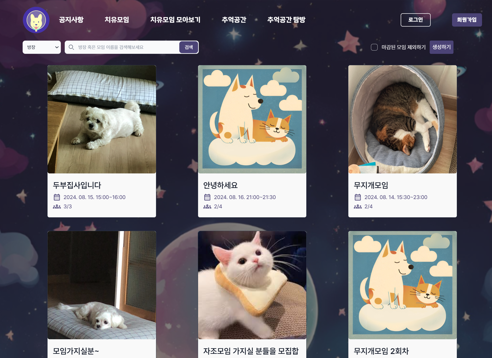

# 공통 프로젝트 Pal:Luxy

## 과제 개요

팰럭시는 소중한 반려동물을 떠나보낼 때 겪는 슬픈 감정, 즉 펫로스 증후군을 개선하는 데 도움이 될 수 있는 서비스들을 제공하는 웹 페이지입니다. 저희 팀은 다양한 기사와 논문을 조사하여, 반려동물을 기르는 가구 수가 증가하고 있음에도 불구하고, 반려동물의 죽음으로 인한 비애가 사회적으로 충분히 인정받지 못하고 있는 실태를 파악했습니다. 이에, 반려인들의 상처를 치유하고 반려동물을 기르지 않는 사람들에게도 펫로스 증후군에 대한 관심을 불러일으킬 수 있는 서비스를 만들기 위해, '극복'과 '소통'이라는 키워드를 중심으로 프로젝트를 구상하였습니다.

사별을 경험한 사람은 누구나 정신적인 고통을 겪지만 이에 대한 대처에 따라 슬픔을 쉽게 극복할 수도 있고, 반대로 치유되지 못하여 오랜 기간동안 힘든 시간을 보낼 수도 있습니다. 팰럭시는 반려동물을 떠나보낸 슬픔을 겪고 있는 사람들이 자신의 감정을 표현하고, 비슷한 경험을 가진 이들과 소통하며 슬픔을 극복할 수 있도록 돕는 것을 목표로 합니다. 이러한 과정을 통해 펫로스 증후군이 더 이상 혼자서 감내해야 할 고통이 아니라, 사회적으로 이해되고 치유될 수 있는 문제로 인식되기를 바랍니다. 팰럭시는 반려동물을 잃은 사람들에게 위로와 희망을 제공하고, 그들의 소중한 추억을 영원히 간직할 수 있는 공간이 될 것입니다.

## 주요 기능

팰럭시의 주요 기능은 '추억공간'과 '치유모임'입니다.

**추억공간**에서는 사용자가 떠나보낸 반려동물의 사진을 입력하면 AI가 그 사진을 3D 모델로 변환해 줍니다. 이 3D 모델은 가상 공간에서 관리할 수 있으며, 추억공간에는 사진을 저장할 수 있는 액자 기능도 있습니다. 또한, 반려동물에게 편지를 쓰면 AI가 답장을 보내주는 편지 쓰기 기능도 제공됩니다. 추억공간은 반려동물과의 추억을 담은 공간을 만들어, 반려동물의 죽음을 마주하고 그것을 극복하는 데 도움을 줍니다.

**치유모임 기능**은 반려인들끼리 화상통화를 통해 서로의 감정을 나누고 위로할 수 있는 장을 마련합니다. 모임을 만드는 사용자가 모임 시간을 정해 공고를 올리고 관리자가 그것을 확인하고 승인하면, 다른 사용자들과 화상통화를 할 수 있습니다. 치유모임은 다른 반려인들과의 소통을 통해 슬픔을 공유하고 반려동물과의 추억을 나누어 펫로스 증후군을 치유하는데 도움을 줍니다.

## 서비스 구현 정도

- 회원가입 / 로그인 / 비밀번호 재발급
- 추억공간 & 탐방
- 치유모임 & 모아보기
- 어드민 페이지
- 마이 페이지

## 개발 기간

- 2024-07-01 ~ 2024-08-16

## Team Info

- **[이보경](https://github.com/kyeong8139) (팀장 - BE)**

  > **BE**  
  > openvidu, claude api의 비동기 통신 구현  
  > 치유모임 / 편지 / 공지사항 / 신고 기능 rest api 구현  
  > blender를 이용한 3d 모델링  
  > 프로젝트 발표 ppt 제작 및 발표

- **[이희주](https://github.com/leepro1) (BE팀장 - BE)**

  > **BE**  
  > 스프링 시큐리티 및 JWT 인증, 인가 관리  
  > 이메일 / 펫 정보 rest api 구현  
  > redis 캐시와 mysql 인덱스 설정으로 DB 성능 향상

  ***

  > **Infra**  
  > 젠킨스 CI/CD  
  > 그라파나, 프로메테우스로 서버 모니터링

- **[박진형](https://github.com/kyeong8139) (팀원 - BE)**

  > **BE**  
  > 3d 모델 생성을 위한, springboot django 간 Reactive Streams 파일 통신 적용  
  > 추억공간과 관련 엔티티(앨범, 방명록) Rest API 구현  
  > UCC 기획 및 제작

- **[최홍석](https://github.com/kyeong8139) (FE팀장 - FE)**

  > **FE**  
  > Three.js를 사용하여 추억공간 페이지 구현  
  > 추억공간 모아보기 페이지 구현  
  > FE 코드 리팩토링

  ***

  > **Infra**  
  > OpenVidu 배포용 서버  
  > S3 버킷  
  > DRF를 이용한 AI모델 서버 구축

- **[임가현](https://github.com/kyeong8139) (팀원 - FE)**

  > **FE**

- **[차재훈](https://github.com/kyeong8139) (팀원 - FE)**
  > **FE**

## TECH

### FE

  
  
  
  
  
  

### FE State Management

  
  

### FE Style

  

### FE Bundler

  

---

### BE

  
  
  
  
  

### BE-AI

  
  
  

### Infra

  
  
  
  
  
  
  
  

## 실행 환경

### FE

- Node : 20.12.0
- React : 18.3.1
- react-router : 6.24.1
- react-query: 5.51.11

### Backend

- JDK : 17.x
- Spring Security : 6.x
- Spring Boot : 3.x
- MySQL : 8.x
- Redis

### Backend-AI

- python : 3.9
- Django : 4.12
- DRF : 3.15.2
- torch : 2.3.1

###

## Infra

- 

## 데이터 베이스 모델링(ERD)

- 

## 서비스 구현 화면

> 치유모임

> 치유모임 모아보기

> 추억공간

> 추억공간 모아보기

## API 명세서

> Swaager 사용

## Git 컨벤션

[깃 컨벤션 문서](./Docs/convention/GIT_CONVENTION.md)

## 프로젝트를 하면서 느낀점

### 배운점

-
-

### 아쉬운점

-
-
